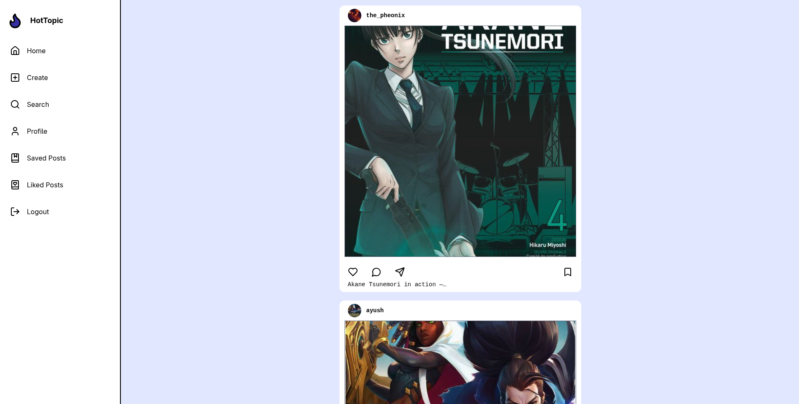
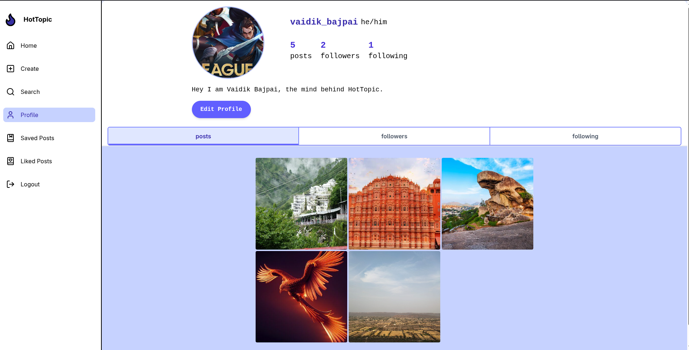

# HotTopic

A social media application that lets you share pictures and connect with others.

Built with a Golang backend (using Chi router and SendGrid for emailing), React frontend (Vite), Cloudinary for media management, PostgreSQL for data storage, and Redis for session management.

## Features

- User Authentication (Signup, Signin, Logout, Password Reset)
- User Profiles (View & Update)
- Follow/Unfollow other users
- Create, Like, Unlike, Save, Unsave Posts
- View user feed, saved posts, liked posts, and posts by user
- Paginated APIs for scalable data fetching

---

## Tech Stack

- **Backend:** Golang, Chi router, SendGrid
- **Database:** PostgreSQL, Redis
- **Frontend:** React (Vite)
- **Media Storage:** Cloudinary
- **Containerization:** Docker & Docker Compose

---

## 📱 Demo

### 🖥️ Desktop View

#### 📰 Feed Page

  
*Feed page of HotTopic as seen on a desktop browser.*

#### 👤 Profile Page

  
*User profile page of HotTopic on desktop.*

### 📱 Mobile View

#### 🎞️ Interaction (GIF)

  
*GIF showing interactive usage on a mobile.*

#### 🖼️ Static Mobile View

  
*Static mobile screenshot demonstrating responsive layout of HotTopic.*

---


## Getting Started

### Prerequisites

- Docker & Docker Compose installed  
- PostgreSQL and Redis (if running locally without Docker)

---

### Environment Variables

Create `.env` files in the respective folders as follows:

**Backend `.env` (`./backend/.env`):**

```env
POSTGRES_HOST=localhost
REDIS_HOST=localhost
POSTGRES_URL=postgres://user:password@${POSTGRES_HOST}:5432/dbname
REDIS_URL=redis://${REDIS_HOST}:6379
SENDGRID_API_KEY=your-sendgrid-api-key
SENDGRID_FROM_EMAIL=your-email@example.com
FRONTEND_ORIGIN=http://localhost:5173
PRODUCTION=true
PORT=:3000
COOKIE_DOMAIN=localhost
```

**Frontend `.env` (`./web/.env`):**

```env
VITE_CLOUD_PRESET=your-cloudinary-preset
VITE_CLOUD_NAME=your-cloudinary-cloud-name
VITE_CLOUDINARY_UPLOAD_URI=https://api.cloudinary.com/v1_1/${VITE_CLOUD_NAME}/image/upload
VITE_BACKEND_BASE_URI=http://localhost:3000

```

----------

### Running with Docker Compose

The application is fully dockerized for easier deployment and development.

From the project root, run:

```bash
docker compose build --no-cache
docker compose up
```

This will start:

-   Backend on port **3000**
    
-   Frontend on port **5173**
    

You can access the frontend at [http://localhost:5173](http://localhost:5173/).

----------

### Running Locally (Without Docker)

1.  **Backend:**
    
    -   Ensure PostgreSQL and Redis are running locally.
        
    -   Create and configure `.env` file as above in `./backend`.
        
    -   Run backend:
        
    
    ```bash
    cd backend
    go run ./cmd
    ```
    
2.  **Frontend:**
    
    -   Create and configure `.env` file as above in `./web`.
        
    -   Install dependencies and run frontend:
        
    
    ```bash
    cd web
    npm install
    npm run dev
    ```
    

----------

## API Overview

> _Note: This is a high-level summary of key API routes._

-   **/auth**  
    Signup, Signin, Logout, Forgot Password, Activate Account, Reset Password
    
-   **/user**  
    Profile management, Follow/Unfollow, List users, Get followers/following, User feed
    
-   **/post**  
    Create post, Like/Unlike post, Save/Unsave post
    
----------

## Contribution

Contributions are welcome! You can:

-   Open issues for bugs or feature requests
    
-   Submit pull requests with improvements or fixes
    

Please ensure code follows project style conventions and commit messages are meaningful.

----------

_Thank you for using HotTopic!_